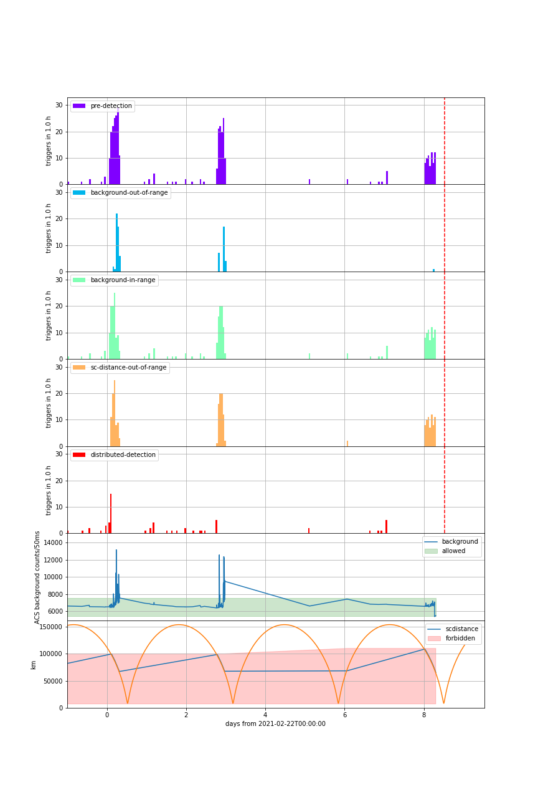
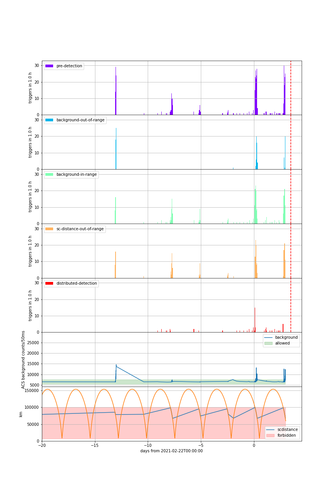
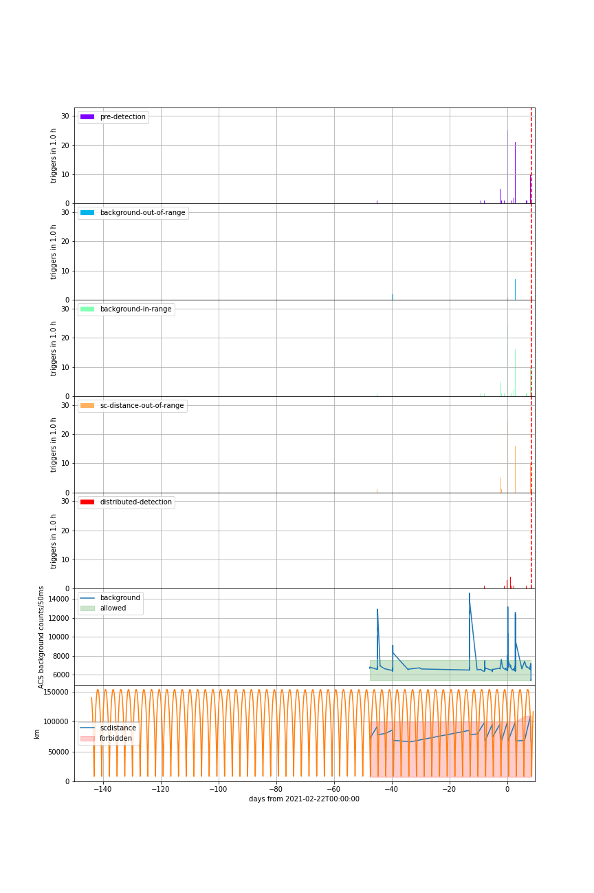

# Extended Radiation Belt event, 2021-02 22-ongoing

since 2021-02-22 Radiation belt is larger than expected causing [false IBAS triggers](https://www.isdc.unige.ch/integral/ibas/cgi-bin/ibas_acs_web.cgi?month=2021-02).

We have adopted limits to reduce false trigger rate, reducing ACS IBAS duty cycle by 5%. Note that ACS data duty cycle is not affected, and remains about 85%.

See [notebook](https://github.com/integral-observatory/spi-acs-triggers-2021-02-22/blob/master/acs-backgroud-triggers.ipynb) for detailed elaboration.

 

